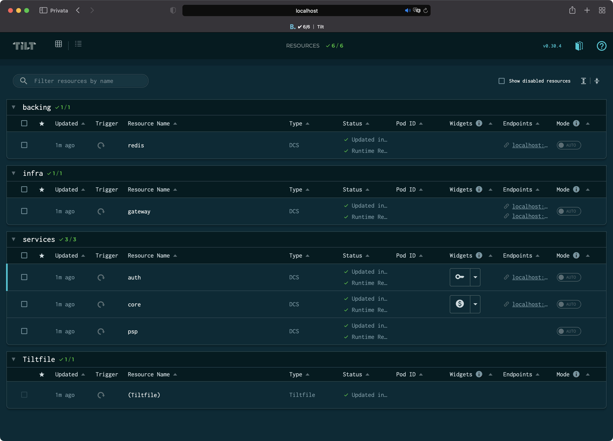

# platform-challenge

## Background

Gr4vy is a building a payment orchestration platform.

This repo is aimed at improving the engineering efficiency by producing automation tools that provision services in an efficient, predictable and reproducible way. More specifically, this repo provides the tools and configurations to automate the provisioning of a **local development** environment.

## Architecture Overview

```text
+----------------------------------+
|            Merchant              |
+-+--------^------------+--------^-+
  |        |            |        |
 (1)      (2)          (3)      (5)
  |        |            |        |
+-v--------+-+        +-v--------+-+        +-----------------+
|  Auth API  |        |  Core API  |        |  PSP Connector  |
+------------+        +------+-----+        +---------^-------+
                             |                        |
                            (4)                      (6)
                             |                        |
                      +------v------------------------+-------+
                      |          Redis Message Queue          |
                      +---------------------------------------+
```

There are 3 distinct services:

- [Auth API] - Creates authentication tokens to valid users.
- [Core API] - Processes transaction requests.
- [PSP Connector] - Processes the transactions with a Payment Service Provider (PSP).

A transaction flow is as follows:

1. A merchant authenticates with the [Auth API] by providing a valid username and password.
2. An authentication token that is valid for 30 seconds is returned.
3. Use this authentication token to make a transaction request to the [Core API].
4. The [Core API] submits the transaction to a message queue for further background processing.
5. A successful response is returned.
6. Meanwhile, a [PSP Connector] processes the transaction from the message queue by connecting to a Payment Service Provider.

We use environment variables to configure a service.

## Requirements

[Docker](https://www.docker.com) (or as alternative [Rancher Desktop](https://rancherdesktop.io)) to run containers.

[Docker compose](https://docs.docker.com/compose) to run multi-container applications infrastructure, defined in a deplarative way.

[Tilt](https://tilt.dev) to provide smart rebuilds, live updates and provide a dashboard to see all the pieces of your app, trigger custom workflows.

[HTTPie](https://github.com/httpie/httpie) to make HTTP requests in user-friendly way via command-line.

## Features

1. Each application is containerized.
2. Updating source code or requirements.txt does not require re-building the Docker container (to increase development velocity).
3. Multi-container application architecture (including backing services), defined declaratively.
4. Out-of-the-box HTTP router in front of the services, providing a single URL with path-based routing
5. Single web-based dashboard to monitor all the services (grouped by categories).
6. Custom web buttons to invoke APIs.

## How to use

1. Check that all dependencies are fulfilled
2. `git clone` this repository and open a terminal in it
3. Type `tilt up` to start all the services and press `space` key to open the dashboard



At this point you can:

- edit the source code and have it instantly up and running inside a container
- make HTTP calls (e.g. via HTTPie) to <http://localhost/auth/*> so that they are proxy-ed to the `auth-api` service
- make HTTP calls (e.g. via HTTPie) to <http://localhost/*> so that they are proxy-ed to the `core-api` service
- watch real time logs for each service by clicking on a service name
- click on the widgets (the `key` and `dollar` icons) to call respectively the `auth/token` and the `/transaction` apis

## Additional (future) improvements

You can edit the `/etc/hosts` file in rodert to have an URLs like <http://platform> instead of <http://localhost>
or even more consider defining a custom DNS server.

[Auth API]: auth-api
[Core API]: core-api
[PSP Connector]: psp-connector
